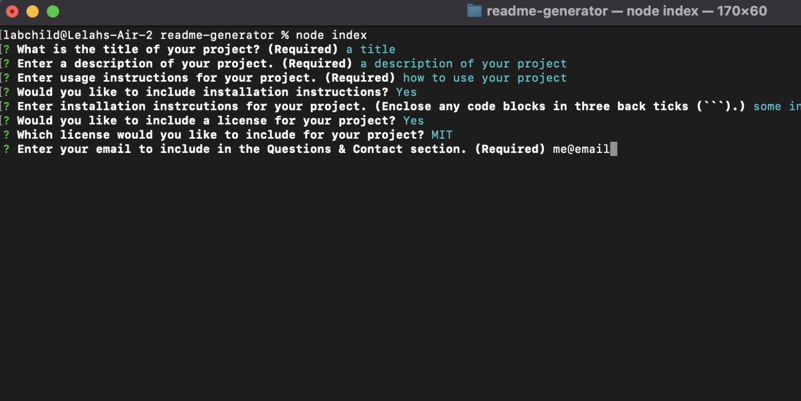

# README Generator
A node.js application that generates a README.md for GitHub repositories.

## Description
This project runs on the command line, prompting the user through a serious of questions relating to their project. Once the user has finished answering questions, a README.md is generated and saved in the project folder for use wherever the user wishes.

A sample README.md is included with this project.

### Table of Contents
* [Installation](#installation)
* [Usage](#usage)
* [License](#license)
* [Questions & Contact](#questions&contact)
* [Acknowledgements](#acknowledgements)

## Installation
Download the code base or clone this repo to your computer. Once you have, you can run the program from your command line or the intergrated terminal of your preferred code editor.

Navigate to the root folder of this project (titled readme-generator) from the command line. Finally, run the following command to set up dependencies and install the program:
```
npm i
```

## Usage
Once youWatch the [video walkthrough](https://drive.google.com/file/d/1gabl1E-ERHXarvHhKxpgTxMzm428QEGc/view?usp=sharing) or follow these steps:

Open your CLI or the integrated terminal in your preferred code editor. Navigate to the root folder of readme-generator.


Run ``` node index ``` to start the program. You can also run ``` npm start ```.


Answer the questions as you are prompted. Each time you press enter, your response will be saved and the next prompt will appear.


When you finsh the prompts, your README will be saved to ```dist``` in the root folder. Open ```dist``` to see your new markdown!


## Questions & Contact
Written and deployed by Lelah Bates Childs.

You can find me on GitHub [@labchild](https://github.com/labchild) or [email me](labchilds@gmail.com).

### Want to Help?
Do you see something I missed or a more succint and effective way this code can be written? Great! Please reach out and let me know how I can improve. Thanks in advance for your tips, tricks, and pointers!

## Acknowledgements ❣️
Thank you to my bootcamp instructional team and cohort, for helping me along this journey to become a developer.
